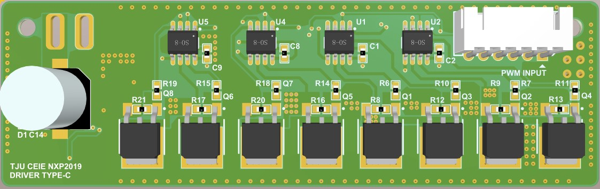

## Competitions

### National College Smart Car Competition

*15 Oct, 2017 - 25 Jul, 2018*

*8 Jun, 2019 - 25 Jul, 2020*

#### Brief: 

Two self-controlled DIY cars with 5 electromagnetic sensors and one 8-bit CMOS camera running on a closed track with a 100 mA in 20Hz AC current  under the lane is accomplished. Besides, the cars are required to finish 3 times of meeting on the 50 cm wide track.

#### Description:

(The two cars are basically identical except for some tiny errors caused by hand-made process.  Hence unless otherwise specified, the following descriptions are for both cars)

1. The car with 4 wheels is DC motor driven and powered by a set of 18650 battery. Direction control relies on the modeled steering gear, which has 6V driven voltage and is controlled by pulse width modulation wave(PWM). 

2. The basic dimension of the car is $27cm \times 16.4cm \times 13.8cm$ .

  

<!-- 

 

 -->

   *Figure1 the "Smart Car" which is everything but smart*

3. A NXP® K60™ Series MCU MK60FX512VLQ10 is used as main control unit. ARM® KEIL™ $\mu Vision5$ is used to program the MCU and debug the program.

4. Four separated two-layer printed copper board (PCB)  is designed. One of the PCBs is used to stabilize, to rise or decrease voltage level and to supply power to each part of the cars. One another is used to magnify the signal received by the sensor, and one is used to connect both 5 sensors to magnifying part. The other PCB is used to drive the 2 DC Motors. Each PCB is connected by DuPont line and  cable lines to conduct signals. And 5mm copper lines are used to conduct current.

   

   *Figure2 One of the Four PCBs (with Altium Designer)*

   

   *Figure3 Another of the Four PCBs (with Altium Designer)*

5. Software in the MCU is self-written and has reached the goal it requires, i.e. self-running  on the closed track and accomplished 3 times of meetings which could been found in Repo [Project_Sonic](https://github.com/SHIELDJY/Project_Sonic).

#### DEMO

<iframe width="560" height="420" src="https://www.youtube.com/embed/rZKlflG4iRU" frameborder="0" allow="accelerometer; autoplay; encrypted-media; gyroscope; picture-in-picture" allowfullscreen>
</iframe>

*This is Demo video for our progress in National College Smart Car Competition. Two cars meeting each other and a turnaround action have been accoplished. (recorded after a sleepless long night)*

#### Honor

* 3rd Place (East China) in 2018
* 2nd Place (East China) in 2019

### National Integrated Circuit Innovation and Entrepreneurship Competition

### T-Head(Alibaba Group) Cup

*15 May, 2020 - 23 Aug, 2020*

#### Brief

This contest requires us to use wujian100 SoC, an open source project developed by Ali Inc. team t-head, and a FPGA develop board with Xlinx XC7A200TR3B Core to manipulate one or several step motors so as to make the best of wujian100 SoC. So, finally we built a yuntai or in another word, a holder in combination of one 57 series step motor and one 47 series step motor with several self-made printed copper boards(PCB) and an inertial measurement unit(IMU), which, to be explicitly, is a 9-axis accelerator sensor.

#### Description

1. As demonstrated in Figure 4 , we use 2 step motor in connection to achieve the motor function and an Organic Light Emitted Diode (OLED) display unit as an interface. As for the communication, we utilize the bluetooth module shown also in the figure so that it could link with computers and smart phones with bluetooth serial port.

   

   *Figure 4 Outlook of the Device*

2. The power supply circuit shown in Figure 5 is designed by ourselves, printed by the factory and soldiered on our own. And it works well during the experiment and the contest.
   
   *(a) Schematic of Self-made PCB*
   
   *(b) Picture of PCB*

   *Figure 5 Power Supply Circuit*

3. We have successfully synthesis, implement, and generate the bitstream file of wujian100 in Windows 10 environment with the help of Vivado 2018.3. wujian100 SoC is proved to be an low energy cost and a less complicated microcontroller due to its low utilization of logical gates. The output of the implementation is shown in Figure 6.

   

   *Figure 6 Layout of FPGA after the Inplementation*

4. We have developed a self-correction mode for this holder, i.e. this design could maintain its angle whenever there are any distrubulances, which is shown in the Demo below.

<iframe width="560" height="420" src="https://www.youtube.com/embed/myroYvsGyDc" frameborder="0" allow="accelerometer; autoplay; encrypted-media; gyroscope; picture-in-picture" allowfullscreen>
</iframe>

#### Honor

* 2nd Place (National) in 2020

### NI Cup

*3 Apr, 2019 - 20 Aug, 2019*

#### Brief

A  Integrated circuit amplifier based on Bipolar Junction Transistor (BJT) is designed with NI® Multisim™ 14. Several technical index are satisfied, i.e. Input offset voltage, offset current, input bias current$I_b$, common mode rejection ratio (CMRR), power supply rejection ratio (PSRR), open-loop voltage gain $G_{ov}$, open-loop bandwidth $f_{Bw}$ output voltage amplitude $V_{opp}$ and slew rate(SR).

#### Honor

* 2nd Place (East China) on Jul, 2019
* Honor of Excellence (National) on Aug, 2019

---

## Government Funded Project

### Mapping Robot Based on Visual SLAM

*12 Apr, 2018 - 20 Apr, 2019*

*Funded by Ministry of Education of PRC*

#### Brief

A Visual Simutaneous Localization and Mapping (v-SLAM) Robot, Jixiaohei（济小黑）(Figure 4)is designed and built to guide the Blinds who have trouble to see what is going on in the surroundings, since in China the construction of barrier-free facilities is generally lagging behind the other countries and there are few ways to make those have problem to see to walk around without professional assistants.

#### Description

A Lidar-based SLAM robot is built formerly by  fellow students, called Jixiaobai (济小白)(Figure 5), to provide a moblie  beverage stand. However, a binocular visual based SLAM robot is built with a $Intel NUC_{TM}$ as processing unit, STM32F108C3T6 in $STMicro$ STM32 Family as controlling unit, two DC Motors as powering and steering unit, a Binocular camera used as visual sensor. The goal of simutaneously localization and mapping is accomplished, however, due to the irreversive PCB damage and the end of funding period, the demo is limited with a few clips of the process.

*Figure 4 Jixiaohei(Visual based SLAM Robot)*

#### DEMOs

Shown as in Figure 5, a Lidar based SLAM Robot could achieve its simutaneous localization and could accomplish its human detection to prevent some unpredictable dangers.

*Figure 5 Demo for Jixiaobai(Lidar-based SLAM Robot by fellow students)*

Shown as in Figure 6, the visual based SLAM Robot could achieve its localization and could automatically map the surroundings in a prettty precise way. The whole software is running on a docker file so that backup and back-going process could be achieved easily.

*Figure 6 Demo for Jixiaohei(Visual based SLAM Robot)*

 However, due to the end of funding period, our project has been stopped to achieving seperately, i.e. we have not yet make the robot move by it self since we choosed a wrong version of NUC with AMD Graphic Card and must use a Thunderbot 3 lightening interface to plug a NIVIDA Graphic Card to run demos on which consumes far more power than we have been thought so fomerly designed low-voltage and current power suppy system could not cooperate with the modified system. Besides, the tiny little robot could hardly afford such heavy two machines, /sad.

 Code has been made public in [VSlamDemo](https://github.com/DmitriZhao/ROS-Navigation-Demo) and now one of our fellow students, [DmitriZhao](https://github.com/DmitriZhao), is still working on this demo in order to run a virtual visual based SLAM for other projects.

 ---

## Coursework(Continuously Upating)

### A Sample Crossing with Traffic Tight(in 1:250 Scale)

#### Brief
